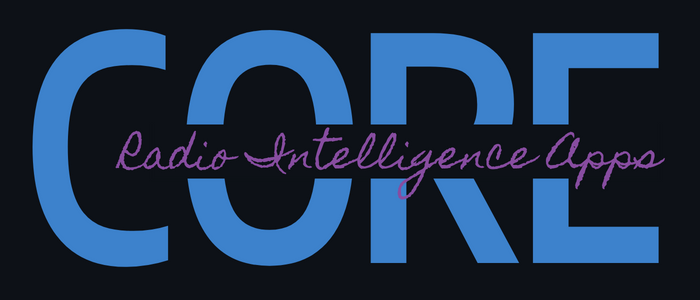

<h2 align="center">
  <br>
  
</h2>

<h3 align="center">By <a href="https://www.qoherent.ai/">Qoherent</a></h3>

<h4 align="center">Let's build intelligent radios together 📡🚀</h4>

<p align="center">
  <!-- License -->
  <a href="https://www.gnu.org/licenses/agpl-3.0">
    
  </a>
  <!-- PyPI -->
  <a href="https://pypi.org/project/ria">
    
  </a>
</p>

# RIA Core

RIA Core serves as the foundational core of [RIAHUB](https://riahub.ai/), an extensive AI development platform designed 
for [software-defined radios](https://en.wikipedia.org/wiki/Software-defined_radio). RIA Core is the 
open-source set of utilities, features, and command-line scripts within the RIAHUB back end.

RIA drives the creation of [intelligent radios](https://www.qoherent.ai/intelligentradio/), unlocking 
solutions in an increasingly congested, contested, and complex wireless spectrum. Explore the RIA project on 
our website [here](https://www.qoherent.ai/radiointelligenceapps-project/).


## 🌟 Key Features

- Synthesize modulated RF recordings based on generated in GNU Radio, MATLAB, or Python rapidly.

- Effortlessly capture and curate RF datasets from [SigMF](https://github.com/sigmf/SigMF) recordings and 
efficiently store them as HDF5, streamlining data management for enhancing accessibility.

- Seamless integration with [IQengine](https://iqengine.org/browser) for visualizing and inspecting recordings.

- Accelerate model development with off-the-shelf deep learning models, tailored for radio applications, 
freeing up more time for research and development.

- Coming soon VIA RIAHUB: Streamline integration and deployment of AI models into SDR-enabled systems, ensuring a 
smooth transition from development to real-world applications.

- Coming soon VIA RIAHUB: Eliminate bottlenecks from your machine learning pipelines with automated process orchestration, 
ensuring smoother workflows and fewer headaches.


## 🚀 Want More RIA? 

- Experience the complete, user-friendly, GUI-based AI development experience offered by 
[RIAHUB](https://www.qoherent.ai/radiointelligenceapps-hub/). This comprehensive solution provides an intuitive and feature-rich environment,
empowering developers to explore, create, and optimize AI applications for SDR.


- [RIARAN](https://www.qoherent.ai/radiointelligenceapps-ran/) allows seamless integration of high-performance ML 
inference software directly onto an open-source [gNodeB](https://inseego.com/resources/5g-glossary/what-is-gnb/), empowering 
you to harness the power of AI for sensing and communications.


## 🛠️ Getting Started

RIA Core is available at [PyPI](https://pypi.org/project/ria), and can be installed with pip:
```sh
pip install ria
```

Interfacing with your local SDR hardware may require additional drivers and configurations.

Please [Read the Docs](docs.radiointelligence.io) for more information on getting started with RIA.

## 🐳 Docker Support

Coming soon: Docker support for building images for both CPU and GPU targets.

## 💻 Usage

RIA Core consists of importable modules and a set of command-line bindings, 
allowing you to execute key functionality from the command line.

For example, if we wanted to curate a dataset from a collection of SigMF recordings, apply an artificial IQ 
Imbalance, and save to file as a machine-learning ready dataset, we could do this from the command line with:
```sh
ria curate --recordings 'data/recordings' --output 'data/datasets/out.h5' --phase_imbalance $pi
```

Alternatively, we could achieve the same in Python with:
```python
from math import pi
from ria import curate
from ria.impairments import iq_imblance

# Curate a radio dataset from a collection of SigMF recordings.
dataset = curate(recordings='data/recordings')

# Apply an artificial IQ Imbalance.
dataset = iq_imblance(dataset=dataset, phase_imbalance=pi)

# Save the dataset to file.
dataset.to_h5('data/datasets/out.h5')
```

We can proceed to train a 4G LTE / 5G NR classifier using this dataset, and save the trained model to file
in ONNX format:
```sh
ria train --train_dataset 'data/datasets/out.h5' --model 'LTE_NR_CLassifier' --batchsize 4 --to_onnx 'models/classifier.onnx'
```

Equivalently, in Python:
```python
from ria.models import LTE_NR_CLassifier
from pytorch_lightning import Trainer
from torch.utils.data import DataLoader

# A custom RIA model, optimized for radio classification!
lte_nr_classifier = LTE_NR_CLassifier()  

# RIA datasets are compatible with the Torch DataLoader...
train_loader = DataLoader(dataset, batch_size=4)

# ...and can be trained using a PyTorch Lightning Trainer! 
trainer = Trainer()
trainer.fit(model=lte_nr_classifier, train_dataloaders=train_loader)

# Save model as ONNX graph
lte_nr_classifier.to_onnx("models/classifier.onnx")
```

If RIA's syntax feels familiar, that's because RIA is built on [PyTorch](https://pytorch.org/docs/stable/data.html) 
and [PyTorch Lightning](https://lightning.ai/docs/pytorch/stable/)! 

Other back-ends can be made available - [Contact us](https://www.qoherent.ai/contact/) for more information.


## 🤝 Contribution

We welcome contributions from the community! Whether it's a bug fix, new feature, or improvement, your 
input is valuable. If you would like to contribute directly to RIA, you will be invited to sign a contributor 
agreement, email us at [info@qoherent.ai](info@qoherent.ai) for more information.

If you have a larger project in mind, please reach out to us by email at 
[info@qoherent.ai](info@qoherent.ai), we'd love to collaborate with you. 🚀

If you are having issues, please let us know by posting the issue on our GitHub issue tracker 
[here](https://github.com/qoherent/ria/issues).

Qoherent is dedicated to fostering a friendly, safe, and inclusive environment for everyone.
Kindly review and adhere to our [Code of Conduct](.github/CODE_OF_CONDUCT.md).

## 🖊️ Authorship

RIA Core is developed and maintained by [Qoherent](https://www.qoherent.ai/) as part of the RIA project, 
and with the invaluable support of 
[many independent contributors](https://github.com/qoherent/ria/network/dependencies).

If you are doing research with RIA, please cite our project:

> [1] Qoherent Inc., "Radio Intelligence Apps," 2024. [Online]. Available: https://github.com/qoherent/ria

If you like what we're doing, don't forget to give the project a star! ⭐

## 📄 License

RIA Core is **free and open-source**, released under [AGPLv3](https://www.gnu.org/licenses/agpl-3.0.en.html).

Alternative licenses are available, [contact us](https://www.qoherent.ai/contact/) for more information. 